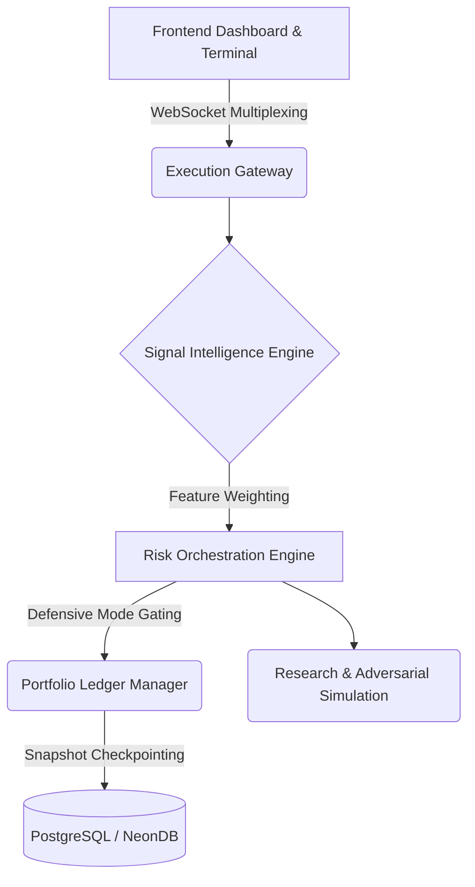

<div align="center">
  <p>
    
    
    
    
  </p>

  <h1>PROMETHEUS</h1>
  <p><strong>AI-Driven Institutional Quant Research & Execution Simulation Platform</strong></p>
  <p><em>Built with React, Node.js, WebSockets, Bayesian inference systems, and event-driven execution architecture.</em></p>
  <p>
    <em>An AI-assisted institutional quantitative research and execution simulation platform featuring explainable decision intelligence, adversarial survivability testing, Bayesian confidence orchestration, and real-time event-driven telemetry architecture.</em>
  </p>
</div>

<br />

## Live Demo

- **Frontend:** https://the-prometheus.vercel.app
- **Backend/API:** https://prometheus-api-zbgy.onrender.com

---

## Platform Preview


*The platform features real-time dashboard updates, live terminal logs, adversarial simulation, and dynamic portfolio changes.*

---

## 1. Core Philosophy

Prometheus prioritizes statistical survivability over curve-fitting and robustness over hype. Designed to model institutional constraints, the platform simulates how professional trading desks validate, reject, stress-test, and govern intelligence prior to capital deployment. It prioritizes transparent, risk-first orchestration over opaque prediction-centric systems, degrading confidence organically in response to market regime shifts.

---

## 2. Why Prometheus Exists

Most retail trading systems optimize for aggressive signal generation while ignoring survivability, statistical degradation, and execution realism. 

Prometheus was designed to explore the opposite philosophy:

*Can an intelligent execution system remain explainable, risk-aware, and operationally resilient under hostile market conditions?*

---

## 3. Research Orientation

Prometheus was designed as a research-oriented intelligent systems platform exploring explainable AI-assisted execution, adversarial survivability, probabilistic confidence orchestration, and institutional-grade quantitative validation workflows.

The platform emphasizes engineering realism, statistical robustness, and operational transparency over speculative predictive performance.

---

## 4. Engineering Focus

Prometheus was engineered primarily as a distributed systems architecture, intelligent orchestration, and quantitative research platform — not as a production trading bot.

The project emphasizes:
- Explainable AI-assisted decision systems
- Event-driven execution pipelines and asynchronous orchestration
- Adversarial survivability testing
- Institutional-grade telemetry infrastructure and runtime observability
- Quantitative validation workflows
- Probabilistic inference and confidence orchestration
- Robust state synchronization

---

## 5. Architecture Highlights

| Layer | Responsibility |
|---|---|
| Signal Intelligence Engine | Multi-factor signal evaluation and confidence scoring |
| Risk Orchestration Engine | Exposure gating, volatility suppression, defensive controls |
| Portfolio Ledger | Capital tracking, allocation management, survivability monitoring |
| Research Engine | Walk-forward validation and statistical robustness analysis |
| Adversarial Engine | Synthetic stress testing and black swan simulation |
| Telemetry Layer | Real-time WebSocket synchronization and event propagation |

---

## 6. Key Capabilities

- **Explainable AI Execution Intelligence:** Deep causal logging of signal acceptance and rejection logic.
- **Regime-Aware Portfolio Orchestration:** Dynamic capital constraints bounded by real-time volatility tracking.
- **Adversarial Stress Testing:** Synthetic tail-risk simulations to evaluate portfolio survivability.
- **Bayesian Confidence Systems:** Probabilistic decay of signal conviction based on market flow.
- **Walk-Forward Validation:** Empirical out-of-sample degradation testing.
- **Risk-Aware Signal Governance:** Execution gating based on multi-factor liquidity and regime health.
- **Real-Time Telemetry Pipelines:** Multiplexed event streams feeding synchronous UI and backend evaluation.
- **Cross-Module Intelligence Synchronization:** Integrated data sharing across risk, signal, and portfolio engines.

---

## 7. System Architecture



The architecture utilizes an event-driven, service-oriented design. State is synchronized across isolated components (Signal Engine, Risk Engine, Portfolio Manager) via an in-memory execution pipeline and validated against a persistent fault-tolerant ledger.

---

## 8. Runtime Intelligence Flow

1. Market telemetry enters the Signal Intelligence Engine.
2. Signals are weighted using probabilistic confidence heuristics.
3. Risk orchestration evaluates volatility, liquidity, and regime stability.
4. Confidence decay penalties are applied dynamically.
5. Portfolio governance validates exposure constraints.
6. Execution decisions are accepted, modified, or rejected.
7. Telemetry events propagate across all platform modules in real time.

---

## 9. Feature Modules

- **Dashboard:** Operates as an institutional command center providing real-time market regime awareness, portfolio exposure monitoring, and continuous global intelligence stream aggregations.
- **Terminal:** Focuses on the execution pipeline. Visualizes live signal scoring, confidence tracing, risk rejection causality, and execution simulation metrics.
- **Portfolio:** Manages capital deployment. Decomposes systemic vs. idiosyncratic risk, tracks sector exposure, and generates continuous health and heat scoring.
- **Research:** Provides rigorous governance. Integrates Bayesian confidence analysis, false discovery quantification, walk-forward optimization, and an automated deployment kill-switch.
- **Analytics:** Assesses statistical robustness, sample quality, out-of-sample degradation, and pipeline validation across extended time horizons.
- **Adversarial:** A dedicated resilience layer executing synthetic attack simulations, black swan scenarios, liquidity stress tests, and Monte Carlo survival modeling.

---

## 10. Explainable AI Layer

Prometheus is explicitly engineered to avoid the "black-box" paradigm. Every lifecycle event is meticulously traced and explained:

**Signal Inception → Risk Evaluation → Confidence Decay → Execution Decision**

The platform generates deep causal commentary detailing precisely why signals are rejected, modified, or accepted. Execution trace logs cite specific criteria—such as momentum divergence, low liquidity, or breadth collapse—providing complete transparency into the decision intelligence engine.

---

## 11. Operational Realism

The platform introduces advanced constraints to mirror professional proprietary desks:
- **Volatility-Aware Penalties:** Automatic confidence suppression as asset-level standard deviations spike.
- **Breadth-Aware Execution Suppression:** Freezing long-exposure when macro-sector participation collapses.
- **Liquidity Sensitivity:** Adaptive scaling based on real-time relative volume thresholds.
- **Defensive Mode Activation:** Portfolio-wide execution halts during detected regime shifts.
- **Portfolio Concentration Controls:** Hard exposure limits preventing idiosyncratic blowout risks.

---

## 12. Live System Characteristics

- Real-time WebSocket telemetry synchronization
- Continuous confidence decay propagation
- Runtime event-stream intelligence updates
- Dynamic defensive-mode activation
- Shared singleton market cache orchestration
- Snapshot-based fault recovery systems
- Cross-module risk propagation pipelines

---

## 13. Technologies & Intelligence Stack

**Frontend Systems:**
- React, Vite, TailwindCSS
- Zustand (Context-based state orchestration)
- Framer Motion, Recharts (Animated telemetry systems)

**Backend Infrastructure:**
- Node.js, Express
- Event-driven execution architecture
- WebSocket multiplexed streaming layer
- Shared singleton market cache

**Persistence Layer:**
- PostgreSQL, NeonDB
- Snapshot checkpoint daemons
- Last-Known-Good (LKG) recovery systems

**Intelligence Infrastructure:**
- Bayesian inference systems
- Regime classification engines
- Adaptive confidence logic
- Explainable AI telemetry logging

---

## 14. ML / AI Concepts Used

*Note: Prometheus focuses on intelligent decision-support, adaptive inference, and explainable execution systems rather than autonomous deep-learning market prediction or production reinforcement learning.*

- **ML-Inspired Intelligence Systems:** Modular evaluation of incoming data streams against historical parameters.
- **Probabilistic Confidence Scoring:** Grading signal quality using variance and expected value heuristics.
- **Feature Weighting:** Dynamic weighting of momentum, volatility, and volume indicators.
- **Adaptive Inference Logic:** State-dependent parameter shifting based on live regime data.
- **Bayesian Confidence Systems:** Continuous updating of priors given new real-time market evidence.
- **Explainable AI Reasoning:** Generating transparent, auditable decision trees.
- **Regime Classification:** Categorizing macro-market states (e.g., trending, volatile, sideways).

---

## 15. Quantitative Finance Concepts

- **Walk-Forward Validation:** Preventing overfitting via sequential out-of-sample evaluation.
- **Volatility Clustering:** Adaptive risk scaling based on observed volatility persistence and regime instability.
- **Drawdown Analysis:** Monitoring continuous peak-to-trough portfolio decay.
- **Survivability Testing:** Modeling edge persistence under adverse mutations.
- **Liquidity Stress:** Simulating execution impact in thin markets.
- **Risk-Adjusted Execution:** Normalizing trade sizing to account for dynamic volatility.

---

## 16. Systems Engineering Concepts

- **Modular Architecture:** Decoupled execution, risk, and data acquisition services.
- **Event-Driven Telemetry:** Non-blocking intelligence pipelines streaming status across the stack.
- **Fault Tolerance & State Recovery:** Resilient execution ledgers utilizing periodic state snapshots.
- **Intelligence Synchronization:** Synchronized context sharing across disparate system modules.
- **Orchestration Pipelines:** Centralized gateways governing the flow of asynchronous intelligence.

---

## 17. Adversarial Research Infrastructure

A core differentiator of Prometheus is the capability to launch hostile market simulations against its own execution intelligence. The platform executes tail-risk testing, black swan modeling, and synthetic liquidity collapse scenarios, ultimately calculating a statistical survivability score that dictates whether an intelligence strategy is fit for deployment.

---

## 18. Statistical Validation Philosophy

The platform operates on strict anti-overfitting principles. Confidence decay, walk-forward degradation, and false discovery suppression are prioritized over optimized backtests. The robustness analysis layer ensures that execution strategies demonstrate statistical persistence before capital is allocated.

---

## 19. Future Enhancements

Future iterations of the platform are designed to scale its institutional and architectural maturity:
- Reinforcement learning-based execution policies
- Distributed execution infrastructure and horizontally scaled signal pipelines
- Kafka/Redis streaming backbones
- Multi-tenant execution orchestration
- Live broker API integrations and smart order routing simulation
- Expanded Monte Carlo stress orchestration
- Advanced factor-model intelligence systems

---

## 20. Engineering Highlights

- Designed explainable AI execution intelligence systems tracing probabilistic decision trees.
- Built adversarial survivability simulation infrastructure evaluating strategies against black swan events.
- Engineered event-driven telemetry architecture utilizing WebSocket multiplexing.
- Developed probabilistic confidence orchestration pipelines enforcing institutional execution realism.
- Implemented robust portfolio governance logic utilizing strict volatility and liquidity constraints.

---

## 21. Project Structure

```text
prometheus/
├── frontend/             # React/Vite client application
│   ├── src/
│   │   ├── components/   # Modular UI architecture
│   │   ├── pages/        # Dashboard, Terminal, Portfolio, Analytics
│   │   ├── store/        # Zustand state orchestration
│   │   └── utils/        # Telemetry parsing & formatting
├── server/               # Node.js backend infrastructure
│   ├── engine/           # Execution and orchestration pipelines
│   ├── intelligence/     # Signal processing and Bayesian inference logic
│   ├── risk/             # Defensive execution logic and regime analysis
│   ├── adversarial/      # Synthetic stress testing infrastructure
│   ├── persistence/      # Ledger, cache, and LKG checkpointing
│   └── data/             # Market data providers and ingestion adapters
├── scripts/              # Validation and deployment utilities
└── package.json          # Dependency specifications
```

---

## 22. Deployment & Setup

**Prerequisites:** Node.js v18+, PostgreSQL (optional for full persistence).

```bash
# Clone the repository
git clone https://github.com/your-org/prometheus.git
cd prometheus

# Install dependencies
cd server && npm install
cd ../frontend && npm install

# Configure environments
# Copy .env.example to .env in the server directory
cp server/.env.example server/.env

# Start backend orchestration
cd server
npm run dev

# Start frontend application (in a new terminal)
cd ../frontend
npm run dev
```

---

## 23. License

This project is licensed under the MIT License.

---

## 24. Disclaimer

Prometheus is an educational and research-oriented platform intended exclusively for systems engineering, quantitative research experimentation, and architectural evaluation. It is not financial advice, a brokerage platform, or a guaranteed profit-prediction engine. No real trading is conducted, and the simulation parameters do not constitute actionable investment guidance.
